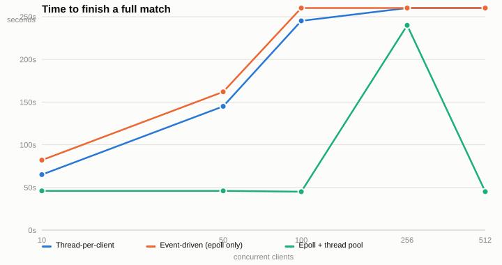
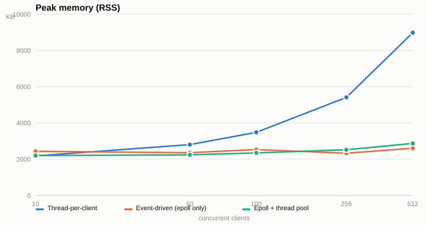
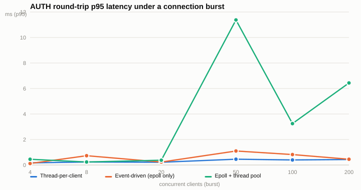

# SocketGambleGame
SocketGambleGame is a multiplayer server-client application where users place bets on simulated matches. It uses TCP for client communication and UDP multicast for game updates, showcasing socket programming and basic betting logic in a networked environment.

## Server Architecture

Three server architectures were built and load-tested against the same protocol: **thread-per-client** (one pthread per connection, blocking `recv`), **event-driven** (single-threaded epoll reactor), and **epoll + thread pool** (epoll reactor dispatching short jobs to a fixed 4-worker pool). `main` now ships the epoll + thread-pool implementation — across every measured scale it finished the match fastest, kept memory flat, and shut down cleanly, while the other two either grew unbounded (threads) or hung after the game (single-threaded epoll's blocking `epoll_wait`/`accept`).

All numbers below are from real runs of `bench/compare_architectures.sh` (10–512 concurrent clients) and a custom burst-latency experiment, not theoretical estimates.

| Clients | Thread-per-client | Event-driven (epoll only) | Epoll + thread pool |
|---:|---:|---:|---:|
| 10  | 65.0s  | 82.0s (hung, exit 124)  | **46.0s** |
| 50  | 145.0s | 162.0s (hung, exit 124) | **46.0s** |
| 100 | 245.2s | 260.2s (hung, exit 124) | **45.0s** |
| 256 | 260.2s (hung, exit 124) | 260.2s (hung, exit 124) | **240.0s*** |
| 512 | 260.2s (hung, exit 124) | 260.2s (hung, exit 124) | **45.1s** |

\*At 256 clients the pool run had 3 client failures under burst (a join-window race), which extended its wait time; at 512 it recovered to a clean 512/512 in 45s. Exit 124 = the harness had to kill a hung server after the match — both thread-per-client and epoll-only frequently never leave their accept loop once the game ends.

Memory tells a similar story: thread-per-client grows from 2.2MB to 8.8MB as client count rises (each blocking thread carries its own stack), while both epoll-based architectures stay near 2.2-2.9MB regardless of scale.

**Edge cases** (`BENCH_EDGE=1`, capacity capped at 256, then 306 clients try to connect): both epoll-based servers admit exactly 256 and reject the other 50 with no crash; epoll-only takes 453s to finish (hangs post-game) vs the pool's 45s. A late-join test (20 early clients, 20 joining after kickoff) shows the pool cleanly accepting the 20 early joiners and rejecting the 20 late ones with `"cannot join now"`.

### Known limitation: the pool's fixed worker count

The one place this architecture can queue under load: `server/thread_pool.c` defines `THREAD_POOL_SIZE 4` — every client message (AUTH, bet, etc.) becomes a job dispatched to exactly 4 worker threads via a shared queue (`JOB_QUEUE_CAPACITY 2048`). A burst experiment — N clients connecting and sending AUTH within the same instant — makes this visible: at N=50 the pool's p95 AUTH round-trip jumps to **~11.4ms** (p99 ~15.0ms), roughly 15-40x the other two architectures at the same burst size, which stay under ~1ms. That's messages queueing behind whichever 4 are already being processed. The 2048-slot queue itself is generous enough that it essentially never blocks the epoll reactor at these scales — the cost shows up as reader-side latency, not a stalled accept loop. Anyone needing lower tail latency under heavy concurrent bursts should look at raising `THREAD_POOL_SIZE` in `server/thread_pool.c`.

| Burst size (clients) | Thread-per-client p95 | Event-driven p95 | Epoll + thread pool p95 |
|---:|---:|---:|---:|
| 4   | 0.17ms | 0.12ms | 0.45ms |
| 8   | 0.23ms | 0.73ms | 0.24ms |
| 20  | 0.22ms | 0.23ms | 0.38ms |
| 50  | 0.46ms | 1.10ms | **11.38ms** |
| 100 | 0.40ms | 0.82ms | 3.25ms |
| 200 | 0.43ms | 0.45ms | 6.44ms |

## Requirements
- **C Compiler**: GCC or any other C compiler
- **Linux**: Tested on Linux, should work on other Unix-like systems
- **POSIX Threads**: For handling multiple clients concurrently

## Server Script
The server script is responsible for managing the game simulation, handling client connections, processing bets, and broadcasting game updates.
1) *TCP and UDP Sockets:*
 The server uses TCP sockets to handle reliable communication with clients, including authentication, bet placement, and sending important game-related messages.
   UDP multicast is used to broadcast real-time game updates to all connected clients, providing a lightweight and efficient way to share information.
2) *Client Management:* The server maintains a list of connected clients using a dynamically allocated array of Client structs, each containing details about the client's socket, betting status, and other metadata.Clients are handled in separate threads, allowing multiple clients to interact with the server concurrently without blocking.
3) *Game Simulation:*  The server simulates a game between two randomly assigned teams, broadcasting the score updates and current game minute via UDP multicast.
    At halftime, the server sends a special message asking clients if they want to double their bets. It waits for client responses and handles defaulting to 'NO' if no response is received.
  
4) *Keep-Alive Mechanism:* A dedicated thread monitors the keep-alive messages from each client to ensure they are still connected. If a client misses keep-alive messages, the server disconnects them.
5) *Error Handling and Testing:* The server includes several test flags (`test_drop_halftime`, `test_multicast_to_wrong_receiver`) to simulate errors and test the robustness of the protocol.
The server can also handle signals (SIGINT, SIGTSTP) to gracefully close connections and shut down.

6) *Final Results:* After the game concludes, the server sends final results to each client based on their bets, including whether they won or lost.
## Client Script
The client script connects to the server, allows the user to authenticate, place bets, and receive real-time game updates. It also handles responses to server prompts during the game.

## Client Script

1) *TCP and UDP Sockets:* Uses TCP for reliable communication with the server (authentication, betting, game results) and UDP multicast to receive real-time game updates like score changes.

2) *Game Interaction:* Authenticates with the server using a password, places bets on the game, and can choose to double the bet during halftime based on server prompts.

3) **Keep-Alive Mechanism:** Periodically sends keep-alive messages to the server to maintain the connection; includes a `test_keepalive_not_recived` flag for testing keep-alive failure scenarios.

4) *Error Handling:* Manages missed or unexpected messages, allowing the client to request missing information, such as halftime prompts, and handles server interruptions gracefully.

5) *Signal Handling:* Responds to interruptions (e.g., Ctrl+C or Ctrl+Z) by notifying the server and safely closing connections to release resources properly.

6) *Final Result Processing:* Receives and verifies final result messages from the server to ensure they match the client's bet, requesting the correct message if necessary.

