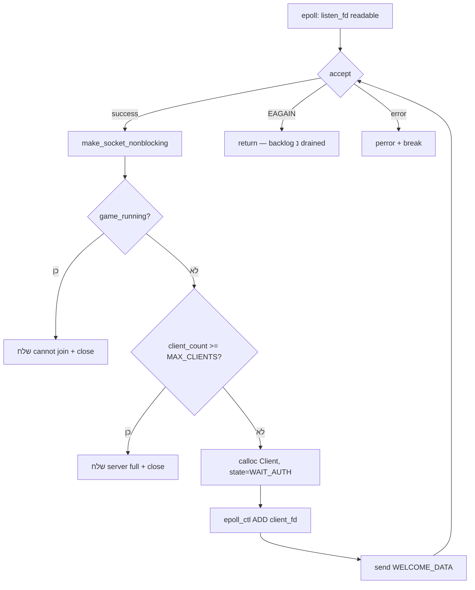
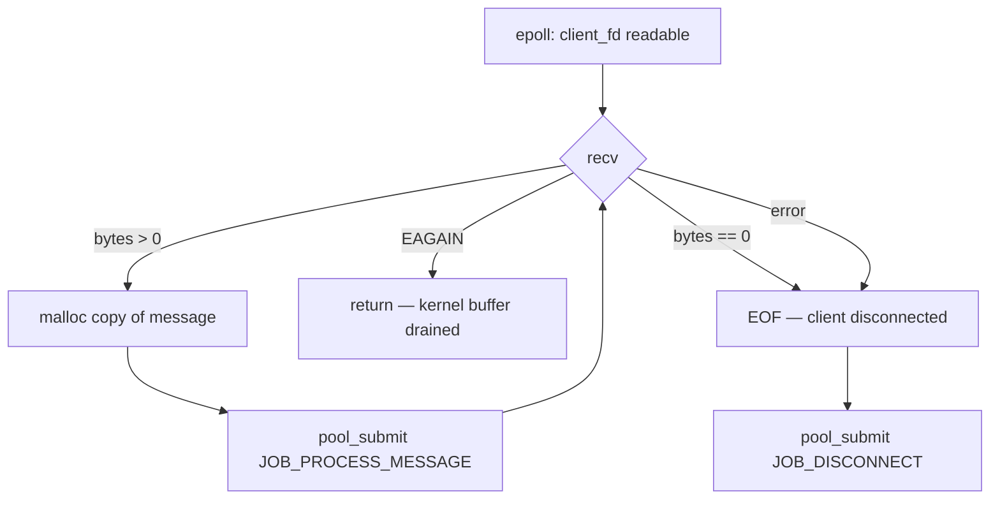
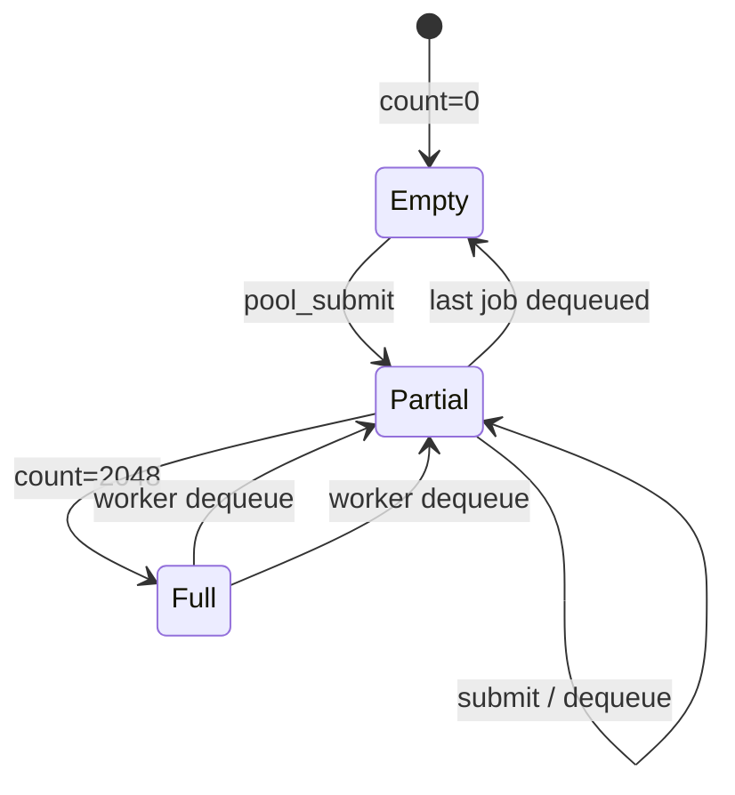
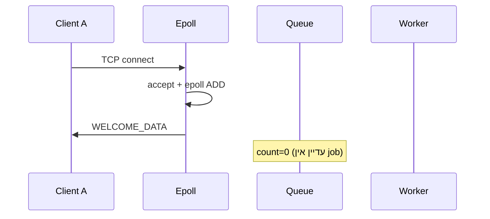
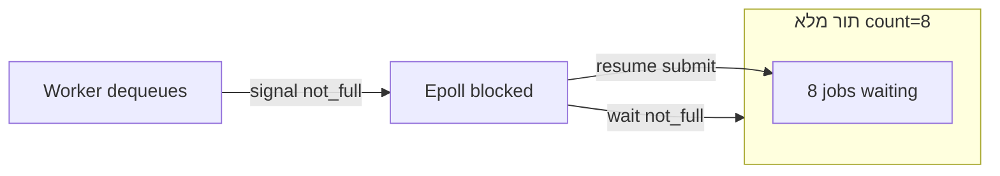
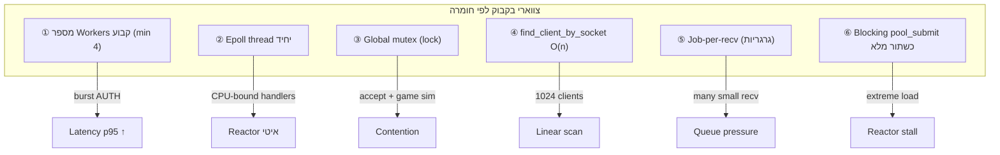
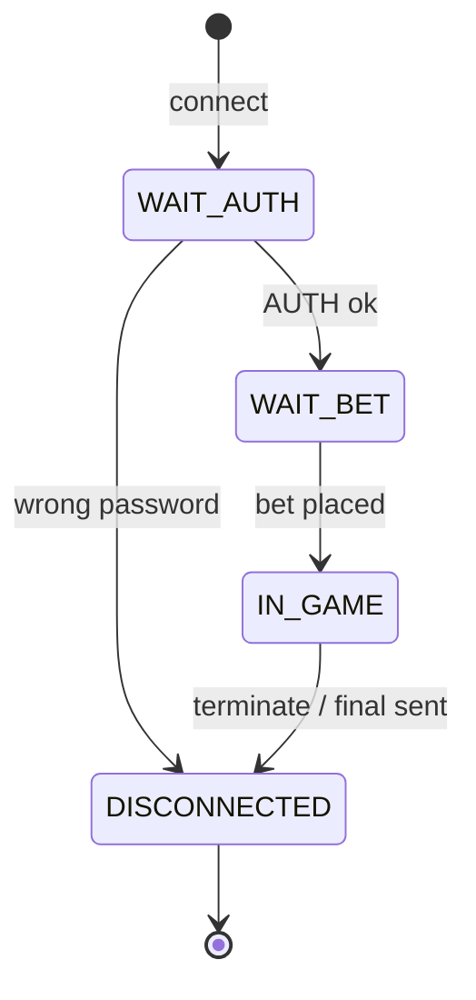
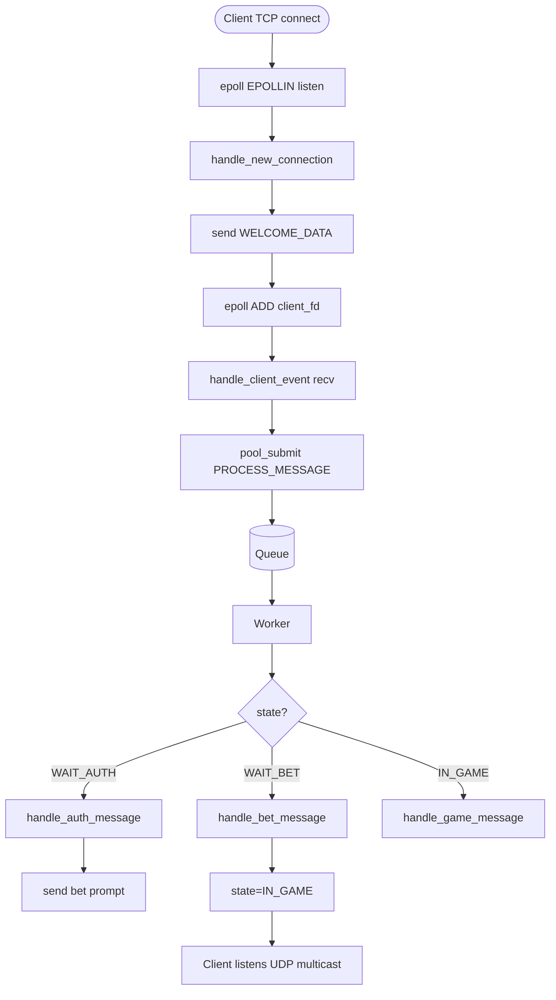
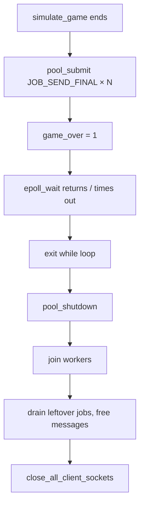

# SocketGambleGame — ארכיטקטורת Epoll + Thread Pool

מסמך זה מתאר את ליבת השרת: **Reactor אחד מבוסס epoll** (Producer) שמזין **Thread Pool** (Consumer) עם תור מעגלי bounded.  
המימוש נמצא בעיקר ב־`server/network.c`, `server/client_handler.c`, `server/thread_pool.c`.

---

## תוכן עניינים

1. [מבט על — שלושה שכבות](#1-מבט-על--שלושה-שכבות)
2. [לוגיקת Epoll — ה-Reactor](#2-לוגיקת-epoll--ה-reactor)
3. [Producer / Consumer — Thread Pool](#3-producer--consumer--thread-pool)
4. [HEAD / TAIL — תור מעגלי](#4-head--tail--תור-מעגלי)
5. [סנריו דוגמה — הרצה צעד-אחר-צעד](#5-סנריו-דוגמה--הרצה-צעד-אחר-צעד)
6. [מקרי קצה](#6-מקרי-קצה)
7. [צווארי בקבוק](#7-צווארי-בקבוק)
8. [טבלאות מרכזיות](#8-טבלאות-מרכזיות)
9. [Flow Diagrams](#9-flow-diagrams)

---

## 1. מבט על — שלושה שכבות

```mermaid
flowchart TB
    subgraph Clients["לקוחות (TCP)"]
        C1[Client 1]
        C2[Client 2]
        CN[Client N]
    end

    subgraph Reactor["שכבה 1: Epoll Reactor (Thread יחיד — Producer)"]
        EW[epoll_wait]
        ACC[accept — חיבורים חדשים]
        RECV[recv — קריאת נתונים]
        SUB[pool_submit]
    end

    subgraph Queue["שכבה 2: Job Queue (Bounded Ring Buffer)"]
        Q[(queue[2048]\nhead / tail / count)]
    end

    subgraph Workers["שכבה 3: Thread Pool (Consumers)"]
        W1[Worker 1]
        W2[Worker 2]
        WN[Worker N\nmin 4, לפי CPU]
    end

    subgraph Handlers["עיבוד הודעות"]
        AUTH[handle_auth_message]
        BET[handle_bet_message]
        GAME[handle_game_message]
        FINAL[send_final_message]
        DISC[JOB_DISCONNECT]
    end

    C1 & C2 & CN -->|TCP| EW
    EW --> ACC & RECV
    ACC & RECV --> SUB
    SUB --> Q
    Q --> W1 & W2 & WN
    W1 & W2 & WN --> AUTH & BET & GAME & FINAL & DISC
```

| שכבה | קובץ | תפקיד | Thread |
|------|------|--------|--------|
| Reactor | `network.c`, `client_handler.c` | I/O לא-חוסם, accept, recv | **1** (main loop) |
| Queue | `thread_pool.c` | buffering בין I/O לעיבוד | — |
| Workers | `thread_pool.c` | AUTH, BET, KEEP_ALIVE, finals | **N** (≥ 4) |
| Game sim | `game.c` | סימולציה, UDP multicast | **1** (detached) |
| Broadcast | `network.c` | countdown עד kickoff | **1** |

---

## 2. לוגיקת Epoll — ה-Reactor

### 2.1 אתחול

ב־`accept_bets()` (`network.c`):

1. `pool_init()` — יוצר workers ותור.
2. `make_socket_nonblocking(socket_fd)` — listen socket לא-חוסם.
3. `epoll_create1(0)` — יוצר epoll instance.
4. `epoll_ctl(ADD, listen_fd, EPOLLIN)` — מאזין לחיבורים נכנסים.
5. Thread נפרד: `broadcast_remaining_time` — countdown UDP.

### 2.2 לולאת האירועים

```c
while (!game_over) {
    int nfds = epoll_wait(epoll_fd, events, MAX_EVENTS, 500);
    for (int i = 0; i < nfds; i++) {
        if (fd == socket_fd)
            handle_new_connection(...);   // accept loop
        else
            handle_client_event(fd, ...); // recv loop
    }
}
```

| פרמטר | ערך | משמעות |
|--------|-----|---------|
| `MAX_EVENTS` | 128 | מקסימום אירועים לכל `epoll_wait` |
| timeout | 500ms | מאפשר לבדוק `game_over` גם בלי traffic |
| `EPOLLIN` | — | socket מוכן לקריאה |

### 2.3 `handle_new_connection` — Drain Accept



**עקרון Drain:** הלולאה ממשיכה `accept()` עד `EAGAIN`, כדי לא להשאיר חיבורים ב־backlog של ה-kernel כשה-reactor עסוק.

### 2.4 `handle_client_event` — Drain Recv



**עקרון Drain:** כל קריאת `recv` שמחזירה נתונים → Job נפרד בתור.  
הודעות TCP מרובות שמגיעות ברצף → מספר Jobs.

---

## 3. Producer / Consumer — Thread Pool

### 3.1 מודל

| תפקיד | מי | פעולה |
|--------|-----|--------|
| **Producer** | Epoll thread (+ `simulate_game` בסוף) | `pool_submit()` — כתיבה ל־`queue[tail]` |
| **Consumer** | Worker threads | dequeue מ־`queue[head]`, `dispatch_job()` |
| **Monitor** | `pthread_cond` + `pthread_mutex` | `not_empty`, `not_full` |

```mermaid
sequenceDiagram
    participant EP as Epoll Thread (Producer)
    participant Q as Ring Buffer
    participant CV as cond vars + mutex
    participant W as Worker (Consumer)

    EP->>CV: lock(mutex)
    alt queue full (count == 2048)
        EP->>CV: wait(not_full)
        Note over EP: חוסם עד ש-worker מרוקן slot
    end
    EP->>Q: queue[tail] = job; tail++
    EP->>Q: count++
    EP->>CV: signal(not_empty)
    EP->>CV: unlock(mutex)

    W->>CV: lock(mutex)
    alt queue empty
        W->>CV: wait(not_empty)
    end
    W->>Q: job = queue[head]; head++; count--
    W->>CV: signal(not_full)
    W->>CV: unlock(mutex)
    W->>W: dispatch_job()
```

### 3.2 סוגי Jobs

| JobType | מקור | handler |
|---------|------|---------|
| `JOB_PROCESS_MESSAGE` | `handle_client_event` | auth / bet / game לפי `client->state` |
| `JOB_SEND_FINAL` | `simulate_game` (סוף משחק) | `send_final_message` |
| `JOB_DISCONNECT` | EOF ב־recv | `epoll_ctl DEL`, `close`, `state=DISCONNECTED` |

### 3.3 Worker loop (Consumer)

```c
while (1) {
    lock(mutex);
    while (count == 0 && !shutdown)
        wait(not_empty);
    job = queue[head];
    head = (head + 1) % CAPACITY;
    count--;
    signal(not_full);
    unlock(mutex);
    dispatch_job(&job);
}
```

---

## 4. HEAD / TAIL — תור מעגלי

### 4.1 מבנה הנתונים

```c
Job  queue[JOB_QUEUE_CAPACITY];  // 2048 slots
int  head;   // אינדקס הוצאה (Consumer)
int  tail;   // אינדקס הכנסה (Producer)
int  count;  // מספר Jobs בתור
```

**כללים:**
- `count == 0` → תור ריק, Consumer ממתין.
- `count == CAPACITY` → תור מלא, Producer ממתין.
- wrap-around: `(index + 1) % JOB_QUEUE_CAPACITY`.

### 4.2 ASCII — תור ריק (capacity = 8 לדוגמה)

```
capacity = 8
head = 0, tail = 0, count = 0

 index:  [0][1][2][3][4][5][6][7]
         ─────────────────────────
         ^head/tail
         (empty)
```

### 4.3 ASCII — אחרי 3 submit, 1 dequeue

```
Producer הכניס 3 jobs (A, B, C)
Consumer הוציא job A

 index:  [ ][B][C][ ][ ][ ][ ][ ]
              ^head    ^tail
         count = 2

head=1  → B מוכן ל-dequeue הבא
tail=3  → slot הבא ל-enqueue
```

### 4.4 ASCII — wrap-around

```
capacity = 8, count = 6
head = 6, tail = 4

 index:  [G][H][ ][ ][D][E][F][ ]
          ^tail              ^head
          
הכנסה הבאה: queue[4] = I  →  tail = 5
הוצאה הבאה: queue[6] = F  →  head = 7
```

### 4.5 דיאגרמת מצבים



---

## 5. סנריו דוגמה — הרצה צעד-אחר-צעד

**הנחות:** 2 לקוחות, `JOB_QUEUE_CAPACITY=8` (להמחשה), 2 workers.

### שלב 0 — אתחול

```
head=0, tail=0, count=0
Workers W0, W1: blocked on not_empty
Epoll: מאזין ל-listen_fd
```

### שלב 1 — Client A מתחבר



### שלב 2 — Client A שולח AUTH

```
Client A → "AUTH:1234\n"

Epoll:
  recv → malloc → pool_submit(JOB_PROCESS_MESSAGE, client=A)

Queue after submit:
  [AUTH_A][ ][ ][ ][ ][ ][ ][ ]
   ^head/tail
  count=1

Worker W0 wakes, dequeues AUTH_A:
  head=1, count=0
  → handle_auth_message → state=WAIT_BET
  → send "Password accepted..."
```

```
Queue after dequeue:
  [ ][ ][ ][ ][ ][ ][ ][ ]
   ^head/tail  count=0
```

### שלב 3 — Burst: B ו-C שולחים AUTH בו-זמנית

```
Epoll מקבל 2 EPOLLIN events, drain:

Submit B → queue[0]=AUTH_B  tail=1  count=1
Submit C → queue[1]=AUTH_C  tail=2  count=2

 index:  [AUTH_B][AUTH_C][ ][ ][ ][ ][ ][ ]
          ^head=0        ^tail=2

W0 dequeues AUTH_B → head=1, count=1
W1 dequeues AUTH_C → head=2, count=0

שני workers עובדים במקביל — latency נמוך.
```

### שלב 4 — תור מלא (edge case)

```
capacity=8, count=8, head=0, tail=0 (מלא מעגלי)

Producer (Epoll) מנסה submit job #9:
  lock → count==8 → wait(not_full)  ← חוסם!

Worker מסיים job:
  dequeue → count=7 → signal(not_full)

Producer מתעורר → enqueue → count=8
```



### שלב 5 — סוף משחק

```
simulate_game:
  for each client → pool_submit(JOB_SEND_FINAL)
  game_over = 1

Epoll loop:
  epoll_wait timeout 500ms → sees game_over → exit
  pool_shutdown() → workers join, queue drained
```

---

## 6. מקרי קצה

| מקרה | מה קורה | קובץ / פונקציה | השפעה |
|------|---------|----------------|--------|
| **תור מלא** (`count == 2048`) | Epoll thread **חוסם** ב־`pthread_cond_wait(not_full)` | `pool_submit()` | accept/recv נעצרים עד ש-worker מרוקן slot — backpressure |
| **תור ריק** | Workers חוסמים ב־`wait(not_empty)` | `worker_main()` | CPU idle — תקין |
| **Server full** (`client_count >= 1024`) | `"Server is full"`, `close` | `handle_new_connection` | דחייה נקייה |
| **Late join** (`game_running == 1`) | `"cannot join now"`, `close` | `handle_new_connection` | דחייה נקייה |
| **EOF / disconnect** | `JOB_DISCONNECT` → epoll DEL + close | `handle_client_event` | אם `pool_submit` נכשל — cleanup inline |
| **`pool_submit` ב-shutdown** | מחזיר `-1` | `pool_submit()` | final messages נשלחים inline ב־`simulate_game` |
| **`malloc` נכשל ב-recv** | הודעה **נזרקת** (return) | `handle_client_event` | לקוח עלול להיתקע — edge case נדיר |
| **`EAGAIN` על recv/accept** | return / break — drain הושלם | non-blocking I/O | התנהגות תקינה |
| **`EINTR` על epoll_wait** | continue | `accept_bets` | retry |
| **סיסמה שגויה** | close socket, `DISCONNECTED` | `handle_auth_message` | worker סוגר — epoll עדיין רשום עד EOF |
| **Halftime timeout** | `recive_halftime=1`, assume NO | `simulate_game` | ברירת מחדל |
| **Burst 50+ AUTH** | p95 latency ~11ms (workers=4) | README benchmarks | queueing, לא crash |

### 6.1 מה קורה כשהבאפר מלא? — פירוט

```
                    ┌─────────────────────────────────────┐
                    │  Epoll Thread (Producer)            │
                    │  handle_client_event → pool_submit│
                    └──────────────┬──────────────────────┘
                                   │
                                   ▼
                    ┌─────────────────────────────────────┐
                    │  count == 2048 ?                    │
                    │  YES → BLOCK on not_full            │
                    │  NO  → enqueue at tail            │
                    └──────────────┬──────────────────────┘
                                   │
          ┌────────────────────────┼────────────────────────┐
          ▼                        ▼                        ▼
   לא מקבל accept חדש      לא drain recv נוסף      kernel TCP buffers
   (אותו thread!)           (אותו thread!)          עלולים להתמלא
```

**Backpressure chain:**
1. Workers איטיים מדי → תור מתמלא.
2. Epoll thread חוסם ב-submit.
3. `epoll_wait` לא נקרא → אין טיפול באירועים חדשים.
4. Latency עולה; בקנה מידה גדול — timeouts אצל לקוחות.

**2048 slots** — מספיק לרוב העומסים הנמדדים (README: "essentially never blocks at these scales").  
הבottleneck האמיתי הוא **4 workers**, לא מלאות התור.

---

## 7. צווארי בקבוק



| # | צוואר בקבוק | מיקום | תסמין | Mitigation |
|---|-------------|--------|--------|------------|
| 1 | **Workers מוגבלים** | `thread_pool.c` — `detect_worker_count()` min 4 | p95 AUTH ~11ms @ 50 clients | הגדל `THREAD_POOL_MIN_WORKERS` / workers |
| 2 | **Reactor יחיד** | `accept_bets` loop | עיבוד I/O serialized | יותר workers, handlers קלים |
| 3 | **`lock` גלובלי** | `client_handler`, `game.c` | contention accept vs sim | fine-grained locks / sharding |
| 4 | **O(n) client lookup** | `find_client_by_socket` | CPU @ many fds | hash map fd→Client |
| 5 | **Job לכל recv** | `handle_client_event` while loop | תור גדל מהר | batch messages / pipeline |
| 6 | **Blocking submit** | `pool_submit` when full | reactor freeze | bigger queue (2048 כבר גדול), faster workers |
| 7 | **HalfTime sequential send** | `broadcast_half_time_message` | O(clients) blocking | async send pool |

### השוואת ארכיטקטורות (מהפרויקט)

| ארכיטקטורה | Wall time @ 512 | Peak RSS | p95 burst @ 50 |
|------------|-----------------|----------|----------------|
| Thread-per-client | hung (124) | ~8.8MB | ~0.46ms |
| Epoll only | hung (124) | ~2.9MB | ~1.10ms |
| **Epoll + Pool (נוכחי)** | **~45s** | **~2.2MB** | **~11.38ms** |

---

## 8. טבלאות מרכזיות

### 8.1 קבועים רלוונטיים

| קבוע | ערך | משמעות |
|------|-----|--------|
| `JOB_QUEUE_CAPACITY` | 2048 | גודל תור Jobs |
| `THREAD_POOL_MIN_WORKERS` | 4 | מינימום workers |
| `MAX_EVENTS` | 128 | batch epoll |
| `MAX_CLIENTS` | 1024 | מגבלת לקוחות |
| `LISTEN_BACKLOG` | 512 | kernel accept queue |
| `BUFFER_SIZE` | 1024 | recv buffer |
| `epoll_wait timeout` | 500ms | polling `game_over` |

### 8.2 מצבי Client (state machine)



| State | הודעות מטופלות |
|-------|----------------|
| `CLIENT_WAIT_AUTH` | `AUTH:password` |
| `CLIENT_WAIT_BET` | `team amount` |
| `CLIENT_IN_GAME` | KEEP_ALIVE, YES/NO, REQUEST_* |
| `CLIENT_DISCONNECTED` | (ignored) |

### 8.3 Threads בשרת

| Thread | פונקציה | תפקיד |
|--------|---------|--------|
| Main | `accept_bets` | epoll reactor |
| Broadcast | `broadcast_remaining_time` | UDP countdown |
| Game | `simulate_game` | score, halftime, finals |
| Pool × N | `worker_main` | job processing |

---

## 9. Flow Diagrams

### 9.1 End-to-end — מחיבור עד הימור



### 9.2 Shutdown flow



### 9.3 Producer-Consumer — תמונה מלאה

```
  ┌─────────────── PRODUCER SIDE ───────────────┐
  │                                               │
  │  epoll_wait ──► accept / recv ──► pool_submit│
  │  simulate_game ──────────────────► pool_submit│
  │                                               │
  └───────────────────────┬───────────────────────┘
                          │ enqueue @ tail
                          ▼
              ┌───────────────────────┐
              │  Ring Buffer [2048]   │
              │  head ──► dequeue     │
              │  tail ──► enqueue     │
              │  count, mutex, cond   │
              └───────────┬───────────┘
                          │ dequeue @ head
                          ▼
  ┌─────────────── CONSUMER SIDE ───────────────┐
  │                                               │
  │  Worker 1..N: dispatch_job()                  │
  │    JOB_PROCESS_MESSAGE → auth/bet/game       │
  │    JOB_SEND_FINAL      → send_final_message  │
  │    JOB_DISCONNECT      → epoll_del + close   │
  │                                               │
  └───────────────────────────────────────────────┘
```

---

## הפניות לקוד

| נושא | קובץ | פונקציה |
|------|------|---------|
| Epoll loop | `server/network.c` | `accept_bets()` |
| Accept drain | `server/client_handler.c` | `handle_new_connection()` |
| Recv drain | `server/client_handler.c` | `handle_client_event()` |
| Queue / workers | `server/thread_pool.c` | `pool_submit()`, `worker_main()` |
| Game + finals | `server/game.c` | `simulate_game()` |

---

## סיכום

| רכיב | תפקיד |
|------|--------|
| **Epoll** | I/O multiplexing לא-חוסם — thread יחיד מנהל אלפי sockets |
| **Producer** | Reactor שולח Jobs לתור — לא מעבד לוגיקה כבדה |
| **Consumer** | Workers מוציאים Jobs ומריצים handlers |
| **HEAD/TAIL** | תור מעגלי — Producer ב-tail, Consumer ב-head |
| **Buffer מלא** | Producer חוסם → backpressure על כל ה-reactor |
| **Bottleneck עיקרי** | מספר workers, לא גודל התור |

---

*נוצר עבור SocketGambleGame — Epoll + Thread Pool architecture.*
