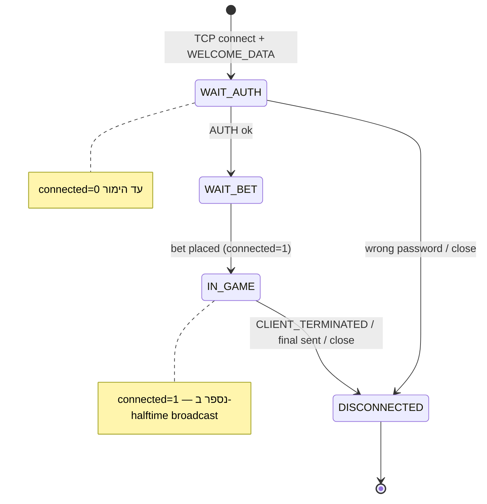
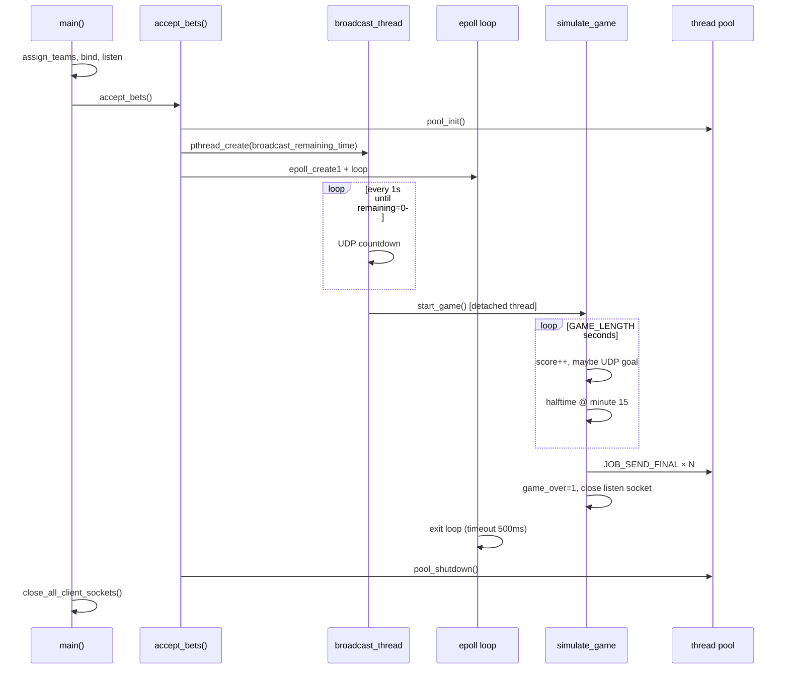
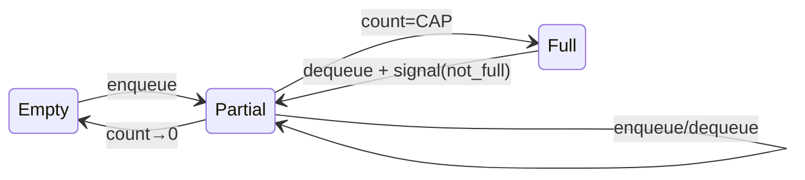
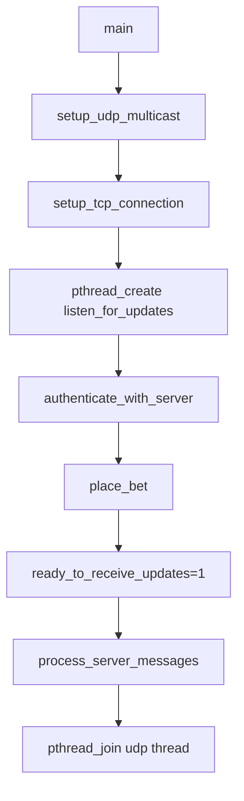
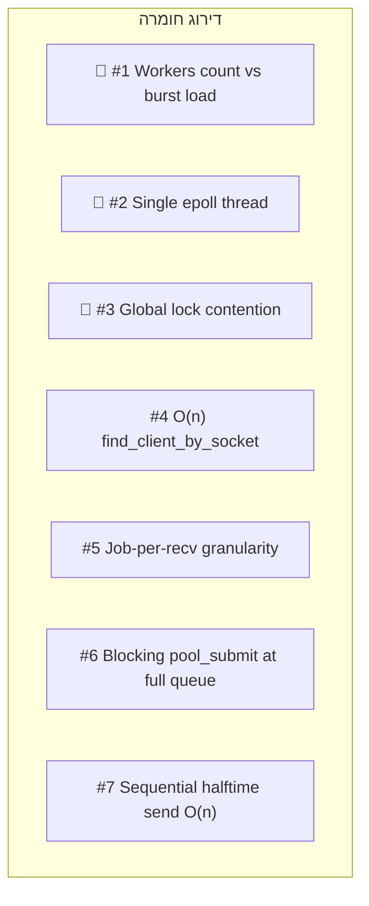
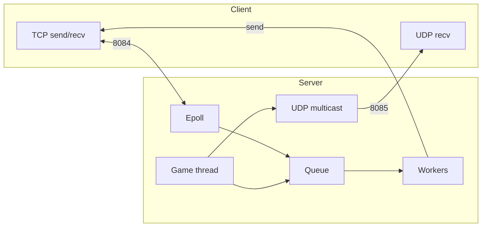
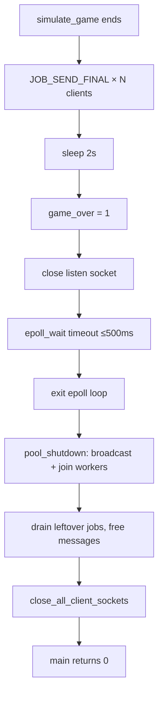

```mermaid
gantt
    title Timeline (default 30s pre + 30s game)
    dateFormat X
    axisFormat %Ss

    section Pre-game
    Countdown UDP     :0, 30
    Clients connect   :5, 25
    AUTH + BET        :8, 22

    section Game
    First half        :30, 15
    Halftime wait     :45, 10
    Second half       :55, 15
    Finals + shutdown :70, 5
```

# SocketGambleGame — תיעוד מלא (DOCS)

> **גרסת קוד:** `main` @ `46748ca` (epoll + thread pool)  
> **קבצים מרכזיים:** `server/network.c`, `server/client_handler.c`, `server/thread_pool.c`, `server/game.c`, `client/*.c`

מסמך זה מתאר את **כל** המערכת: פרוטוקול, threads, epoll, producer/consumer, תור HEAD/TAIL, מקרי קצה, צווארי בקבוק, וסנריו הרצה מלא עם דיאגרמות.

---

## תוכן עניינים

1. [סקירה כללית](#1-סקירה-כללית)
2. [מבנה הפרויקט והרצה](#2-מבנה-הפרויקט-והרצה)
3. [פרוטוקול TCP/UDP — כל ההודעות](#3-פרוטוקול-tcpudp--כל-ההודעות)
4. [מחזור חיים של השרת](#4-מחזור-חיים-של-השרת)
5. [לוגיקת Epoll — Reactor מפורט](#5-לוגיקת-epoll--reactor-מפורט)
6. [Producer / Consumer — Thread Pool + Monitor](#6-producer--consumer--thread-pool--monitor)
7. [HEAD / TAIL — תור מעגלי מלא](#7-head--tail--תור-מעגלי-מלא)
8. [Mutexes, Threads, בעלות זיכרון](#8-mutexes-threads-בעלות-זיכרון)
9. [ארכיטקטורת לקוח](#9-ארכיטקטורת-לקוח)
10. [סימולציית משחק](#10-סימולציית-משחק)
11. [סנריו הרצה מלא — 3 לקוחות](#11-סנריו-הרצה-מלא--3-לקוחות)
12. [מקרי קצה — מטריצה מלאה](#12-מקרי-קצה--מטריצה-מלאה)
13. [צווארי בקבוק](#13-צווארי-בקבוק)
14. [דגלי בדיקה (Test Flags)](#14-דגלי-בדיקה-test-flags)
15. [Flow Diagrams](#15-flow-diagrams)
16. [מילון מונחים](#16-מילון-מונחים)

---

## 1. סקירה כללית

SocketGambleGame הוא שרת-לקוח multiplayer לסימולציית הימורים על משחק כדורגל.  
**הארכיטקטורה הפעילה** (ב־`main`) היא **Epoll Reactor + Thread Pool**:

```
┌─────────────┐     TCP (8084)      ┌──────────────────────────────────────┐
│   Clients   │◄───────────────────►│  Epoll Thread (Producer)             │
│             │                     │    accept / recv (non-blocking)       │
└──────┬──────┘                     │    pool_submit()                      │
       │                            └──────────────┬───────────────────────┘
       │ UDP Multicast (8085)                      │
       │ 239.0.0.1                                 ▼
       ▼                            ┌──────────────────────────────────────┐
┌─────────────┐                     │  Ring Buffer [2048] head/tail/count  │
│  listen_for │◄── broadcast ───────│  pthread_mutex + cond vars           │
│  _updates   │                     └──────────────┬───────────────────────┘
└─────────────┘                                    │
                                                   ▼
                                    ┌──────────────────────────────────────┐
                                    │  Worker Threads (Consumers, N≥4)     │
                                    │  AUTH / BET / GAME / FINAL / DISC    │
                                    └──────────────────────────────────────┘
```

| ערוץ | פורט | פרוטוקול | שימוש |
|------|------|----------|--------|
| TCP | 8084 | reliable, stream | AUTH, הימור, halftime, finals, REQUEST_* |
| UDP | 8085 | multicast `239.0.0.1` | countdown, עדכוני שער (goal-only) |

**עקרון הפרדה:**
- **Epoll thread** — רק I/O (מהיר, לא חוסם).
- **Workers** — לוגיקה עסקית + `send()` ללקוח.
- **Game thread** — סימולציה + UDP broadcast.
- **Broadcast thread** — countdown עד kickoff.

---

## 2. מבנה הפרויקט והרצה

### 2.1 עץ קבצים

```
SocketGambleGame/
├── server/
│   ├── server_main.c      # main, bind, listen
│   ├── network.c          # epoll loop, UDP, signals
│   ├── client_handler.c   # accept/recv handlers, message handlers
│   ├── thread_pool.c/h    # producer-consumer queue
│   ├── game.c             # simulate_game, teams
│   ├── globals.c          # globals + test flags
│   └── server.h           # constants, structs
├── client/
│   ├── client_main.c      # flow: connect → auth → bet → messages
│   ├── tcp.c              # TCP connect, auth, bet
│   ├── udp.c              # multicast listener + halftime recovery
│   ├── messaging.c        # select loop, halftime, finals
│   └── client.h
└── docs/
    ├── DOCS.md            # ← מסמך זה
    └── ARCHITECTURE_HE.md # סיכום ארכיטקטורה
```

### 2.2 קompilation והרצה

```bash
# Terminal 1 — Server
cd server && make && ./server

# Terminal 2 — Client (חוזר על כל לקוח)
cd client && make && ./client
```

| קבוע | ערך | קובץ |
|------|-----|------|
| `PORT` | 8084 | `server.h`, `client.h` |
| `MULTICAST_PORT` | 8085 | |
| `MULTICAST_GROUP` | 239.0.0.1 | |
| `SECRET_PASSWORD` | 1234 | `server.h` |
| `GAME_DURATION` | 30s | זמן המתנה עד kickoff |
| `GAME_LENGTH` | 30s | משך המשחק (דקות סימולציה) |
| `HalfTimer_respose` | 10s | המתנה לתשובת halftime |

---

## 3. פרוטוקול TCP/UDP — כל ההודעות

### 3.1 Server → Client (TCP)

| שלב | פורמט | דוגמה | קובץ |
|-----|--------|--------|------|
| Welcome | `WELCOME_DATA:{team1}:{team2}:{remaining}:{game_length}` | `WELCOME_DATA:Brazil:Germany:25:30` | `client_handler.c:149` |
| Auth OK | `Password accepted. Place your bet (0): tie, (1): {t1}, (2): {t2}) and amount (BY DOLLARS): ` | — | `client_handler.c:252` |
| Auth fail | `Incorrect password. Connection closed.\n` | — | |
| Late join | `The game has already started. You cannot join now.\n` | — | |
| Server full | `Server is full. Try again later.\n` | — | |
| Halftime | `HALFTIME: Do you want to double your bet? Reply with 'YES' or 'NO'.\n` | — | |
| Game state (on demand) | `Minute {n}: Team {t1}: {s1}, Team {t2}: {s2}\n` | — | `game.c:format_game_update` |
| Final win | `Congratulations! You won your bet of {amt} $ on {team}\n` | — | |
| Final lose | `Sorry, you lost your bet of {amt} $ on {team}\n` | — | |
| Interrupt | `The game has been interrupted by the server.\n` | — | |

> **חשוב:** `GAME_LENGTH` נשלח ב־`WELCOME_DATA` — **השרת הוא source of truth** (תיקון פרוטוקול ב־`f619554`). הלקוח שומר ב־`GAME_LENGTH` global.

### 3.2 Client → Server (TCP)

| הודעה | פורמט | State נדרש | handler |
|--------|--------|------------|---------|
| AUTH | `AUTH:{password}` | `CLIENT_WAIT_AUTH` | `handle_auth_message` |
| Bet | `{team} {amount}` | `CLIENT_WAIT_BET` | `handle_bet_message` |
| Keep-alive | `KEEP_ALIVE:` | `CLIENT_IN_GAME` | `handle_game_message` |
| Halftime YES/NO | `YES` / `NO` | `CLIENT_IN_GAME` | `handle_game_message` |
| Request halftime | `REQUEST_HALFTIME_MESSAGE` | `CLIENT_IN_GAME` | `handle_game_message` |
| Request final | `REQUEST_FINAL_MESSAGE` | `CLIENT_IN_GAME` | `handle_game_message` |
| Request state | `REQUEST_GAME_STATE` | `CLIENT_IN_GAME` | `handle_game_message` |
| Terminate | `CLIENT_TERMINATED {amount}` | any | `handle_game_message` |

### 3.3 Server → All (UDP Multicast)

| הודעה | פורמט | מתי |
|--------|--------|-----|
| Countdown | `Time remaining until the game starts: {n} seconds\n` | כל שנייה, 30s לפני kickoff |
| Goal update | `Minute {n}: Team {t1}: {s1}, Team {t2}: {s2}\n` | **רק כשיש שער** (goal-only broadcast) |

> UDP **לא** נשלח halftime/finals — רק TCP. הלקוח מזהה שגיאה אם מגיע via UDP.

### 3.4 State Machine — לקוח בשרת



---

## 4. מחזור חיים של השרת



| שלב | זמן (ברירת מחדל) | `game_running` | חיבורים חדשים |
|-----|------------------|----------------|---------------|
| Pre-game | 0–30s | 0 | ✅ מותר |
| First half | 1–15 min sim | 1 | ❌ late join נדחה |
| Halftime | 10s wait | 1 | ❌ |
| Second half | 16–30 min sim | 1 | ❌ |
| Post-game | ~3s finals | 0 | ❌ (listen socket נסגר) |

---

## 5. לוגיקת Epoll — Reactor מפורט

### 5.1 למה Epoll?

| גישה | בעיה |
|------|------|
| Thread-per-client | stack לכל לקוח, RSS גדל, hang בסיום |
| Epoll only (single thread) | handlers חוסמים את ה-loop → hang |
| **Epoll + Pool** | I/O מהיר + עיבוד מקבילי |

### 5.2 אתחול — `accept_bets()`

```97:151:server/network.c
void accept_bets(int socket_fd, ServerContext *ctx) {
    ctx->start_time = time(NULL);
    if (pool_init() != 0) { ... }
    make_socket_nonblocking(socket_fd);
    pthread_create(&broadcast_thread, NULL, broadcast_remaining_time, ctx);
    int epoll_fd = epoll_create1(0);
    // epoll_ctl ADD listen_fd EPOLLIN
    while (!game_over) {
        int nfds = epoll_wait(epoll_fd, events, MAX_EVENTS, 500);
        for (int i = 0; i < nfds; i++) {
            if (fd == socket_fd)
                handle_new_connection(...);
            else
                handle_client_event(fd, epoll_fd);
        }
    }
    close(epoll_fd);
    pthread_join(broadcast_thread, NULL);
    pool_shutdown();
}
```

### 5.3 שכבות Buffer — Kernel vs User

```
┌─────────────────────────────────────────────────────────────┐
│                        CLIENT                                │
└────────────────────────────┬────────────────────────────────┘
                             │ TCP
┌────────────────────────────▼────────────────────────────────┐
│  KERNEL: socket receive buffer (SO_RCVBUF)                  │
│  ──► EPOLLIN fires when data available                      │
└────────────────────────────┬────────────────────────────────┘
                             │ recv() [non-blocking]
┌────────────────────────────▼────────────────────────────────┐
│  USER: Epoll thread — stack buffer[BUFFER_SIZE=1024]        │
│  ──► malloc copy ──► Job.message                             │
└────────────────────────────┬────────────────────────────────┘
                             │ pool_submit
┌────────────────────────────▼────────────────────────────────┐
│  USER: Ring buffer queue[2048] — Job structs                  │
└────────────────────────────┬────────────────────────────────┘
                             │ worker dequeue
┌────────────────────────────▼────────────────────────────────┐
│  USER: Worker — dispatch_job, handler logic, send()         │
└─────────────────────────────────────────────────────────────┘
```

### 5.4 Level-Triggered (ברירת מחדל)

המערכת משתמשת ב־**LT** (ברירת מחדל של epoll):
- `EPOLLIN` נשאר active כל עוד יש data ב-kernel buffer.
- לכן **Drain loop** חובה — `recv` עד `EAGAIN`.

### 5.5 `handle_new_connection` — Accept Drain

```70:163:server/client_handler.c
while (1) {
    int client_fd = accept(...);
    if (client_fd < 0) {
        if (errno == EAGAIN) break;  // backlog drained
        ...
    }
    make_socket_nonblocking(client_fd);
    pthread_mutex_lock(&lock);
    // checks: game_running, client_count >= MAX_CLIENTS
    // calloc Client, clients[]++, state=WAIT_AUTH
    pthread_mutex_unlock(&lock);
    epoll_ctl(ADD, client_fd, EPOLLIN);
    send WELCOME_DATA:...:remaining:GAME_LENGTH
}
```

| בדיקה | תנאי | פעולה |
|--------|------|--------|
| Late join | `game_running == 1` | `"cannot join now"`, close |
| Capacity | `client_count >= 1024` | `"server full"`, close |
| OOM | `calloc` fails | close, continue |

### 5.6 `handle_client_event` — Recv Drain

```5:68:server/client_handler.c
while (1) {
    int bytes = recv(client_fd, buffer, BUFFER_SIZE-1, 0);
    if (bytes < 0 && (EAGAIN|EWOULDBLOCK)) return;
    if (bytes == 0) { pool_submit(JOB_DISCONNECT); return; }
    // malloc + pool_submit(JOB_PROCESS_MESSAGE)
}
```

**הערות קריטיות:**
1. כל `recv` מוצלח → **Job נפרד** (לא batching).
2. `message` מועבר כ־pointer — **Worker משחרר** (`free` ב־`dispatch_job`).
3. `find_client_by_socket` — O(n) scan, **ללא lock** (race אפשרי תיאורטי).

---

## 6. Producer / Consumer — Thread Pool + Monitor

### 6.1 מבנה הנתונים

```23:35:server/thread_pool.h
typedef struct {
    Job             queue[JOB_QUEUE_CAPACITY];  // 2048
    int             head;   // Consumer reads here
    int             tail;   // Producer writes here
    int             count;
    pthread_mutex_t mutex;
    pthread_cond_t  not_empty;  // Consumer waits
    pthread_cond_t  not_full;   // Producer waits
    pthread_t      *workers;
    int             num_workers;
    int             shutdown;
    int             started;
} ThreadPool;
```

### 6.2 Monitor Pattern — Pseudo-code

```
// ─── PRODUCER: pool_submit() ───
lock(mutex)
while count == CAPACITY and not shutdown:
    wait(not_full, mutex)          // ← BLOCKING POINT
if shutdown: unlock; return -1
queue[tail] = job
tail = (tail + 1) % CAPACITY
count++
signal(not_empty)
unlock(mutex)

// ─── CONSUMER: worker_main() ───
lock(mutex)
while count == 0 and not shutdown:
    wait(not_empty, mutex)         // ← BLOCKING POINT
if shutdown and count == 0: unlock; exit
job = queue[head]
head = (head + 1) % CAPACITY
count--
signal(not_full)                   // ← wakes blocked Producer
unlock(mutex)
dispatch_job(&job)                 // OUTSIDE lock — good!
```

### 6.3 Invariants (תמיד חייבים להתקיים)

| Invariant | נוסחה |
|-----------|--------|
| Count bounds | `0 <= count <= CAPACITY` |
| Elements stored | `count` slots between head (inclusive) and tail (exclusive) |
| Empty | `count == 0` |
| Full | `count == CAPACITY` |
| Usable slots when full | 0 — **לא** משאירים slot ריק (classic bounded buffer) |

### 6.4 סוגי Jobs

| JobType | Producer | Consumer action | `message` ownership |
|---------|----------|-----------------|---------------------|
| `JOB_PROCESS_MESSAGE` | epoll recv | auth/bet/game handler | Worker frees |
| `JOB_SEND_FINAL` | simulate_game | `send_final_message` | NULL |
| `JOB_DISCONNECT` | epoll EOF | epoll_del + close | NULL |

### 6.5 Dispatch — routing לפי state

```19:37:server/thread_pool.c
switch (job->client->state) {
case CLIENT_WAIT_AUTH:  handle_auth_message(...); break;
case CLIENT_WAIT_BET:   handle_bet_message(...);  break;
case CLIENT_IN_GAME:    handle_game_message(...); break;
default: break;
}
```

> הודעה שמגיעה ב-state "לא נכון" — **נזרקת בשקט** (default case).

### 6.6 Worker count

```86:91:server/thread_pool.c
static int detect_worker_count(void) {
    long n = sysconf(_SC_NPROCESSORS_ONLN);
    if (n < THREAD_POOL_MIN_WORKERS)  // min = 4
        n = THREAD_POOL_MIN_WORKERS;
    return (int)n;
}
```

| מכונה | workers |
|-------|---------|
| 2 cores | 4 (floor) |
| 8 cores | 8 |
| 16 cores | 16 |

---

## 7. HEAD / TAIL — תור מעגלי מ完整

### 7.1 הגדרות

```
CAPACITY = 2048 (בproduction) / 8 (בדוגמאות)

head  → אינדקס ה-Job הבא ל-DEQUEUE (Consumer)
tail  → אינדекс ה-Job הבא ל-ENQUEUE (Producer)
count → כמה Jobs בתור עכשיו
```

### 7.2 תור ריק

```
CAP=8, head=0, tail=0, count=0

Idx:  [0][1][2][3][4][5][6][7]
       ↑
     head=tail

Producer submit X:  queue[0]=X, tail=1, count=1
Consumer dequeue X: job=queue[0], head=1, count=0
```

### 7.3 תור חלקי

```
אחרי submit A,B,C ו-dequeue A:

Idx:  [·][B][C][·][·][·][·][·]
          ↑head  ↑tail
       count=2

הבא לdequeue: B @ head=1
הבא לenqueue: slot 3 @ tail=3
```

### 7.4 Wrap-around

```
CAP=8, count=6, head=6, tail=4

Idx:  [G][H][·][·][D][E][F][·]
       ↑tail=4          ↑head=6

Enqueue I: queue[4]=I, tail=5, count=7
Dequeue F: queue[6]=F, head=7, count=5
Dequeue ·: queue[7]=?, head=0 (wrap!), count=4
```

### 7.5 תור מלא — מקרה קriti

```
CAP=8, count=8, head=0, tail=0  (מעגל מלא)

Idx:  [A][B][C][D][E][F][G][H]
       ↑head/tail

Producer tries submit I:
  lock → count==8 → wait(not_full)  ★ EPOLL THREAD BLOCKED ★

Worker dequeues A: count=7, signal(not_full)
Producer wakes: queue[0]=I, tail=1, count=8
```



### 7.6 Timeline — 5 submits, 2 workers, CAP=8

```
T=0ms   []                          head=0 tail=0 count=0
T=1ms   [J1]                        Producer: epoll submit J1
T=2ms   [J1,J2,J3]                  burst recv from 3 clients
T=3ms   [J3]                        W0 done J1, W1 done J2
T=4ms   []                          W0 done J3
T=5ms   [J4,J5,J6,J7,J8]            burst 5 messages
T=6ms   [J4..J8] + Producer BLOCKED  submit J9 → wait(not_full)
T=7ms   [J5..J8,J9]                 W0 dequeued J4, Producer woke
```

---

## 8. Mutexes, Threads, בעלות זיכרון

### 8.1 Mutex `lock` (global)

| מי נועל | למה | קובץ |
|---------|-----|------|
| `handle_new_connection` | clients[], client_count | client_handler.c |
| `broadcast_remaining_time` | game_running, start_time | network.c |
| `broadcast_half_time_message` | iterate clients | network.c |
| `simulate_game` | game_state, client snapshot | game.c |
| `handle_game_message` (REQUEST_GAME_STATE) | format_game_update | client_handler.c |

**⚠️ אין lock ב־`find_client_by_socket`** — נקרא מ-epoll thread בלבד (בפועל).

### 8.2 Mutex `g_pool.mutex`

רק בתוך `thread_pool.c` — מגן על head/tail/count.

### 8.3 טבלת Threads

| # | Thread | Entry point | Blocking calls |
|---|--------|-------------|----------------|
| 1 | Main | `accept_bets` → epoll loop | `epoll_wait(500ms)`, `pool_submit` if full |
| 2 | Broadcast | `broadcast_remaining_time` | `sleep(1)` |
| 3 | Game | `simulate_game` | `sleep(1)`, `sleep(10)` halftime |
| 4..N+3 | Workers | `worker_main` | `pthread_cond_wait` |
| — | Client UDP | `listen_for_updates` | `select(1s)` |
| — | Client main | `process_server_messages` | `select` blocking |

### 8.4 בעלות זיכרון

| מ resource | מי מקצה | מי משחרר |
|-----------|---------|----------|
| `Job.message` | epoll (`malloc`) | worker (`free` in dispatch_job) |
| `Client` struct | epoll (`calloc`) | ❌ never freed (leak per session — pre-existing) |
| `Job` struct copy | value copy to queue | automatic (stack) |

---

## 9. ארכיטקטורת לקוח

### 9.1 Flow



### 9.2 TCP — Auth & Bet (`tcp.c`)

1. **Read** `WELCOME_DATA:team1:team2:remaining:game_length`
2. Parse → `GAME_LENGTH` from server (authoritative)
3. **Send** `AUTH:1234`
4. **Read** password response
5. **Send** `{team} {amount}`

Timeout: `wait_for_stdin_or_server(sock, 15)` — 15s.

### 9.3 UDP — `listen_for_updates` (`udp.c`)

| הודעה UDP | פעולה |
|-----------|--------|
| `remaining` | print countdown; anchor `match_start` when remaining≤0 |
| `Minute` | print score; backdate `match_start` if missed countdown |
| `HALFTIME` / finals | **ERROR** — expected on TCP only |

**Halftime recovery** (לא תלוי ב-UDP):
```c
if (time(NULL) - match_start >= GAME_LENGTH/2 && !halftime_received)
    send(tcp, "REQUEST_HALFTIME_MESSAGE");
```

### 9.4 Messaging loop (`messaging.c`)

| Input | פעולה |
|-------|--------|
| Enter (no halftime pending) | `REQUEST_GAME_STATE` → TCP |
| Enter during halftime | send YES/NO |
| TCP HALFTIME | prompt user |
| TCP final | validate team name, retry if wrong |

---

## 10. סימולציית משחק

```47:137:server/game.c
for (j = 1; j <= GAME_LENGTH; j++) {
    // random goal 50% per team per minute
    if (goal) broadcast_game_update(...);  // UDP, goal-only

    if (j == GAME_LENGTH/2) {
        broadcast_half_time_message();  // TCP to all connected
        sleep(10);  // HalfTimer_respose
        // default NO for non-responders
    }
    sleep(1);  // 1 real second = 1 game minute
}
// enqueue JOB_SEND_FINAL for each client
// game_over=1, close listen socket
```

| דקה | phase | UDP | TCP |
|-----|-------|-----|-----|
| 0 | PRE | countdown | WELCOME, AUTH, BET |
| 1–14 | FIRST_HALF | goals only | KEEP_ALIVE, REQUEST_* |
| 15 | HALFTIME | — | HALFTIME prompt |
| 16–29 | SECOND_HALF | goals only | YES/NO responses |
| 30 | OVER | — | FINAL results |

---

## 11. סנריו הרצה מלא — 3 לקוחות

**Setup:** Server starts, 3 clients connect within pre-game window.

### T+0s — Server boot

```
main → teams assigned (e.g. Brazil vs Germany)
accept_bets → pool_init (4+ workers)
broadcast_thread → "Time remaining: 30 seconds"
epoll → listening
```

### T+5s — Alice connects (client_id=0)

```
Epoll: accept alice_fd
  lock → client_count=1, state=WAIT_AUTH
  epoll_ctl ADD alice_fd
  send "WELCOME_DATA:Brazil:Germany:25:30"

Queue: (empty — connect doesn't create job)
```

### T+8s — Alice sends AUTH

```
Epoll: recv "AUTH:1234\n"
  malloc → pool_submit(PROCESS_MESSAGE, alice)

Queue:  [AUTH_A]  head=0 tail=1 count=1

Worker W0:
  handle_auth_message → state=WAIT_BET
  send "Password accepted. Place your bet..."

Queue:  []  count=0
```

### T+10s — Bob & Charlie connect + AUTH burst

```
Epoll drain:
  accept bob_fd, charlie_fd
  recv AUTH from both (2 EPOLLIN events)

Queue after 2 submits:
  [AUTH_B][AUTH_C]  head=0 tail=2 count=2

W0 → AUTH_B → WAIT_BET
W1 → AUTH_C → WAIT_BET   (parallel!)
```

### T+12s — All place bets

```
3× recv "1 100" / "2 50" / "0 200"
3× pool_submit → 3 jobs

Queue may hold 1-3 jobs depending on worker speed
All → state=IN_GAME, connected=1
```

### T+30s — Game starts

```
broadcast: remaining=0 → start_game()
simulate_game: game_running=1

New connect attempt → "cannot join now"
```

### T+45s — Minute 15, Halftime

```
simulate_game: broadcast_half_time_message (TCP loop all connected)
sleep(10) — wait for YES/NO

Alice: "YES" → bet_amount *= 2
Bob: (no response) → default NO
Charlie: "NO"
```

### T+60s — Game over

```
simulate_game:
  snapshot 3 clients
  pool_submit(SEND_FINAL) × 3

Workers send:
  "Congratulations!..." or "Sorry, you lost..."

game_over=1
epoll loop exits within 500ms
pool_shutdown()
```



---

## 12. מקרי קצה — מטריצה מלאה

| # | מקרה | Trigger | התנהגות | חומרה |
|---|------|---------|----------|--------|
| 1 | **Queue full** | 2048 pending jobs | Epoll blocks on `not_full` | 🔴 Critical under extreme load |
| 2 | **Queue empty** | no traffic | Workers block on `not_empty` | ✅ Normal |
| 3 | **Server full** | client #1025 | reject message, close | ✅ Graceful |
| 4 | **Late join** | connect after kickoff | reject, close | ✅ Graceful |
| 5 | **Wrong password** | bad AUTH | close socket, DISCONNECTED | ✅ Worker handles |
| 6 | **EOF disconnect** | client close | JOB_DISCONNECT | ✅ |
| 7 | **pool_submit fail** | shutdown | inline cleanup / inline final | ✅ Fallback |
| 8 | **malloc fail** | OOM on recv | message dropped, return | 🟡 Client may hang |
| 9 | **Wrong state msg** | AUTH during IN_GAME | silently ignored | 🟡 |
| 10 | **Halftime timeout** | no YES/NO in 10s | assume NO | ✅ |
| 11 | **Missed halftime TCP** | network drop | client REQUEST_HALFTIME | ✅ Recovery |
| 12 | **Wrong final message** | test flag | client REQUEST_FINAL | ✅ Recovery |
| 13 | **SIGINT server** | Ctrl+C | notify all, game_over | ✅ |
| 14 | **Burst 50 AUTH** | load test | p95 ~11ms queue delay | 🟡 Latency |
| 15 | **Job-per-recv** | TCP coalescing | multiple jobs per "logical message" | 🟡 Queue pressure |
| 16 | **listen socket closed** | end of game | no new accepts | ✅ By design |
| 17 | **Worker closes socket** | bad password | epoll still registered until EOF | 🟡 Orphan epoll entry |
| 18 | **simulate_game closes listen fd** | post-game | epoll may get error on listen | ✅ game_over exits loop |

### 12.1 Buffer מלא —שרשרת Backpressure (פירוט)

```
Workers slow
    ↓
count → 2048
    ↓
pool_submit() blocks (Producer = Epoll thread)
    ↓
epoll_wait NOT called
    ↓
No new accepts, no recv drains
    ↓
Kernel TCP buffers fill
    ↓
Client send() blocks or times out
    ↓
Latency ↑↑, possible connection drops
```

**מתי זה קורה בפועל?** כמעט never ב-benchmarks (2048 >> typical burst).  
**מתי כן?** workers איטיים + אלפי messages/sec + handlers כבדים.

---

## 13. צווארי בקבוק



| # | Bottleneck | מיקום | מדידה | Mitigation |
|---|------------|--------|-------|------------|
| 1 | Workers | `thread_pool.c` | p95 AUTH 11.4ms @ 50 burst | ↑ `THREAD_POOL_MIN_WORKERS` |
| 2 | Single reactor | `network.c` | serialized I/O dispatch | more workers, lighter handlers |
| 3 | Global `lock` | multiple files | accept vs game sim | per-subsystem locks |
| 4 | Linear client lookup | `find_client_by_socket` | O(n) per recv | fd→Client hash map |
| 5 | 1 job/recv | `handle_client_event` | queue churn | message batching |
| 6 | Full queue block | `pool_submit` | reactor freeze | faster workers, bigger pool |
| 7 | Halftime loop | `broadcast_half_time_message` | blocking send × N | async send queue |

### Benchmarks (מ-README)

| Clients | Epoll+Pool wall time | Peak RSS | p95 burst@50 |
|--------:|---------------------:|---------:|-------------:|
| 10 | 46s | 2.2MB | — |
| 512 | 45s | 2.2MB | 11.38ms |

---

## 14. דגלי בדיקה (Test Flags)

| Flag | `globals.c` | אפect |
|------|-------------|--------|
| `test_drop_halftime` | server | skip TCP halftime send |
| `test_multicast_to_wrong_reciver` | server | send wrong final result |
| `test_drop_password` | server | skip WELCOME_DATA send |
| `test_keepalive` | server | (client-side) |
| `test_keepalive_not_recived` | client | suppress keep-alive |
| `disable_keep_alive_check` | server | — |

---

## 15. Flow Diagrams

### 15.1 End-to-end data flow



### 15.2 Producer-Consumer complete

```
 ╔════════════════════ PRODUCERS ════════════════════╗
 ║  ① Epoll thread: recv/accept → pool_submit       ║
 ║  ② simulate_game: finals → pool_submit           ║
 ╚════════════════════════╤══════════════════════════╝
                          │ enqueue @ tail
                          ▼
              ┌───────────────────────┐
              │  queue[2048]          │
              │  head ──► dequeue     │
              │  tail ──► enqueue     │
              │  mutex + cond vars    │
              └───────────┬───────────┘
                          │ dequeue @ head
                          ▼
 ╔════════════════════ CONSUMERS ════════════════════╗
 ║  Worker 1..N: dispatch_job()                       ║
 ║    PROCESS_MESSAGE / SEND_FINAL / DISCONNECT       ║
 ╚════════════════════════════════════════════════════╝
```

### 15.3 Shutdown



---

## 16. מילון מונחים

| מונח | הסבר |
|------|------|
| **Reactor** | דפוס: thread אחד מ-multiplex I/O events |
| **Producer** | מי שמכניס Jobs לתור (`pool_submit`) |
| **Consumer** | Worker שמוציא Jobs (`worker_main`) |
| **Monitor** | mutex + condition variables לsync |
| **Drain** | loop עד EAGAIN — רוקן kernel buffer |
| **Backpressure** | Producer חוסם כשהתור מלא |
| **LT (Level Triggered)** | epoll מדווח כל עוד יש data |
| **Goal-only broadcast** | UDP נשלח רק כשיש שער, לא כל דקה |
| **HEAD** | אינדקס dequeue בתור המעגלי |
| **TAIL** | אינדקס enqueue בתור המעגלי |

---

## נספח — הפניות קוד מהירות

| נושא | קובץ:שורות |
|------|------------|
| Epoll loop | `network.c:97-151` |
| Accept handler | `client_handler.c:70-163` |
| Recv handler | `client_handler.c:5-68` |
| pool_submit | `thread_pool.c:126-145` |
| worker_main | `thread_pool.c:63-84` |
| dispatch_job | `thread_pool.c:19-61` |
| simulate_game | `game.c:47-137` |
| WELCOME_DATA | `client_handler.c:149-153` |
| REQUEST_GAME_STATE | `client_handler.c:304-313` |
| Client halftime recovery | `udp.c:115-127` |
| Client Enter → state | `messaging.c:50-68` |

---

*עודכן לפי קוד `main` @ 46748ca — כולל WELCOME_DATA+GAME_LENGTH, REQUEST_GAME_STATE, halftime recovery.*
